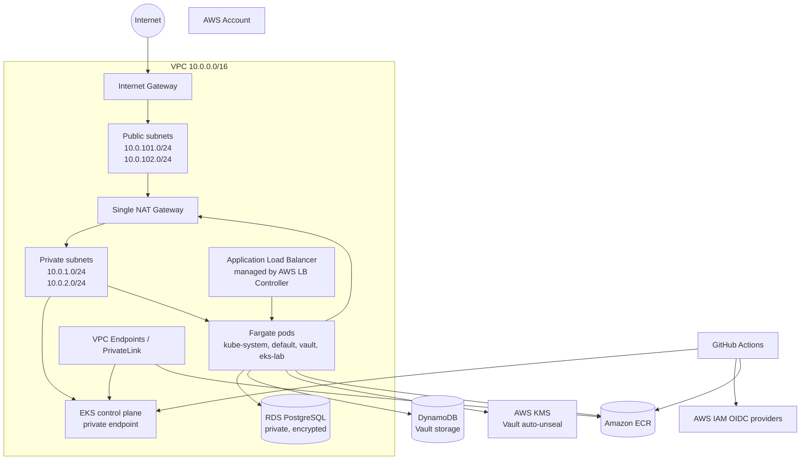
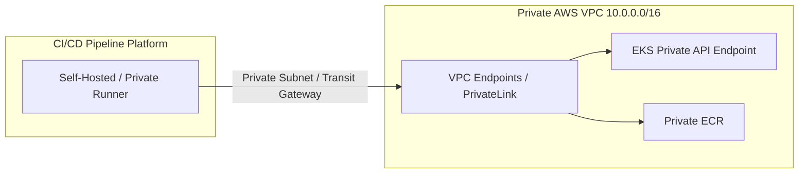

# AWS EKS Fargate Lab

This Terraform project provisions an Amazon EKS cluster that runs Kubernetes workloads on AWS Fargate. It also demonstrates private networking, an AWS Load Balancer Controller, an encrypted PostgreSQL database, HashiCorp Vault with AWS-backed storage and auto-unseal, an ECR repository, and GitHub Actions access through OIDC.

## Architecture Overview



## Main Components

### Networking

`01-vpc-network.tf` creates a VPC with CIDR `10.0.0.0/16` across the first two available Availability Zones in the selected AWS region.

* Two public subnets: `10.0.101.0/24` and `10.0.102.0/24`
* Two private subnets: `10.0.1.0/24` and `10.0.2.0/24`
* One NAT gateway shared by the private subnets
* Public subnet tags for internet-facing AWS load balancers
* Private subnet tags for internal load balancers

Fargate pods and the EKS endpoint use the private subnets. The NAT gateway provides outbound internet access for private resources that need to download images or reach external services.

### EKS control plane

`02-eks-cluster.tf` creates the EKS control plane and its IAM role.

* EKS authentication uses `API_AND_CONFIG_MAP`
* The Kubernetes API endpoint is private-only
* Both public and private VPC subnets are associated with the cluster
* An EKS OIDC provider is created for IAM Roles for Service Accounts (IRSA)

Because the API endpoint is private, `kubectl` and Terraform Helm operations must run from a network that can reach the VPC, such as a VPN, bastion host, connected runner, or another resource inside the VPC.

### Fargate workloads

`03-eks-fargate-profiles.tf` creates one Fargate execution role and four profiles. Pods are scheduled onto Fargate according to their Kubernetes namespace:

| Namespace | Profile |
| --- | --- |
| `kube-system` | `kube-system` |
| `default` | `app-profile` |
| `vault` | `vault-profile` |
| `eks-lab` | `eks-lab-profile` |

There are no managed node groups in this project. Workloads in namespaces without a matching profile will not be scheduled onto Fargate.

### Application images

`04-ecr-registry.tf` creates the `eks-lab-app` ECR repository.

* Image tags are immutable
* Images are scanned on push
* GitHub Actions receives permission to push and pull images

The Terraform code creates the repository but does not deploy an application Deployment or Service. Those Kubernetes manifests must be applied separately.

### PostgreSQL database

`05-rds-database.tf` provisions a private PostgreSQL 15 RDS instance.

* Database name: `appdb`
* Instance class: `db.t4g.micro`
* Storage starts at 20 GiB and can grow to 100 GiB
* Storage encryption is enabled
* Public access is disabled
* The database is placed in the private subnets
* Inbound TCP port `5432` is allowed from the EKS cluster security group
* A final snapshot is retained on destruction because `skip_final_snapshot = false`

The database username and password are supplied through Terraform variables. They should be stored in a secure secret-management system rather than committed to `terraform.tfvars`.

### AWS Load Balancer Controller

`06-aws-lb-controller.tf` creates the IAM policy and IRSA role required by the AWS Load Balancer Controller, then installs the controller with Helm in `kube-system`.

When an application exposes a Kubernetes Ingress or Service configured for the controller, it can provision an AWS load balancer in the tagged subnets. The controller receives AWS permissions through the EKS OIDC provider rather than static credentials in the pod.

### HashiCorp Vault

`07-vault-secrets-engine.tf` provisions the AWS services and Helm release used by Vault:

* DynamoDB stores Vault data and HA state
* DynamoDB point-in-time recovery is enabled
* DynamoDB server-side encryption is enabled
* KMS key rotation is enabled for the Vault auto-unseal key
* Vault uses an IRSA role restricted to the `vault` service account in the `vault` namespace
* Vault runs in HA mode with the injector enabled
* Vault's embedded listener has TLS disabled, so network exposure must be tightly controlled

The Vault Helm release uses the `vault` Fargate profile and depends on the DynamoDB table, KMS key, and IAM permissions.

### 💡 Solving Vault High Availability & Auto-Unseal Architecture

Deploying HashiCorp Vault on EKS using standard Shamir Secret Sharing introduces a major operational challenge: every time a Vault pod restarts or scales out across Fargate nodes, human intervention is required to manually input key shares to unseal the storage.

To eliminate manual overhead and build a production-grade High Availability (HA) platform, this architecture addresses the challenge directly:

* **3-Pod High Availability (HA):** Runs a 3-replica Vault cluster behind DynamoDB storage, ensuring zero downtime and continuous leader election across EKS availability zones.
* **AWS KMS Auto-Unseal Engine:** On pod initialization or unexpected restart, Vault detects encrypted data in DynamoDB, automatically queries AWS KMS via IAM Roles for Service Accounts (IRSA) using `kms:Decrypt`, and unseals itself without manual operator intervention.
* **Automated Failure Recovery:** Eliminates manual unseal keys during pod lifecycle updates or cluster patching, guaranteeing uninterrupted secrets engine availability for microservices.

### Private CI/CD Pipeline Integration (VPC PrivateLink & Self-Hosted Runners)

Because the EKS Kubernetes API endpoint is configured as **private-only** (`endpoint_private_access = true`), SaaS CI/CD runners (like standard GitHub-hosted runners, Bitbucket Cloud runners, or GitLab.com SaaS runners) running on public networks cannot directly execute `kubectl` commands against the cluster.

To secure automated deployments across GitHub Actions, Bitbucket Pipelines, GitLab CI/CD, and other pipeline platforms, this architecture utilizes VPC PrivateLink, VPC Peering, or Self-Hosted Runners:

#### Option 1: Self-Hosted Runners inside the VPC (Recommended)

Deploy self-hosted runner agents inside the VPC private subnets (or using AWS Fargate / EC2 Spot / Actions Runner Controller on EKS).

* **GitHub Actions:** Use **Actions Runner Controller (ARC)** on EKS or ephemeral EC2 self-hosted runners.
* **GitLab CI/CD:** Deploy a **GitLab Runner** pod inside the `kube-system` or dedicated namespace via Helm.
* **Bitbucket Pipelines:** Deploy a **Bitbucket Runner** as a deployment inside the private VPC subnet.

#### Option 2: Private Network Connectivity via AWS PrivateLink & Transit Gateway

If using hosted/managed CI/CD runners (such as GitHub-Hosted Runners connected via AWS PrivateLink or self-managed runners in a separate central Management/DevOps VPC):

* **AWS PrivateLink (VPC Endpoints):** Enables direct, private interface connectivity between external or runner VPCs and AWS service endpoints (ECR, STS, KMS, SSM) without leaving the AWS backbone network.
* **VPC Peering / AWS Transit Gateway:** Routes traffic privately between your CI/CD runner VPC and the EKS cluster VPC, allowing `kubectl` deployments over private IPs without exposing the EKS API server to the internet.



### CoreDNS

`08-coredns-fargate-patch.tf` runs local commands after cluster creation to:

1. Update the local kubeconfig.
2. Remove the EKS compute-type annotation from the CoreDNS Deployment.
3. Restart CoreDNS so it can be scheduled using the `kube-system` Fargate profile.

This requires the local machine running Terraform to have the AWS CLI and `kubectl` installed and authenticated.

### GitHub Actions access

`09-github-oidc-ci-cd.tf` configures keyless GitHub Actions authentication using an AWS IAM OIDC provider.

The role trust policy is limited to the repository supplied by `var.github_repo`. The role can:

* Describe the EKS cluster
* Authenticate to ECR
* Push and pull images in the application repository
* Access the EKS cluster through an EKS access entry and cluster administrator policy

The cluster administrator permission is intentionally broad for a lab, but should be narrowed for production CI/CD.

## Terraform File Map

| File | Responsibility |
| --- | --- |
| `00-variables.tf` | Input variables and defaults |
| `01-vpc-network.tf` | VPC, subnets, NAT gateway, and Kubernetes subnet tags |
| `02-eks-cluster.tf` | EKS cluster IAM role, cluster, and EKS OIDC provider |
| `03-eks-fargate-profiles.tf` | Fargate execution role and namespace profiles |
| `04-ecr-registry.tf` | ECR application image repository |
| `05-rds-database.tf` | RDS PostgreSQL instance and security group |
| `06-aws-lb-controller.tf` | Load Balancer Controller IAM resources and Helm release |
| `07-vault-secrets-engine.tf` | Vault storage, KMS auto-unseal, IRSA, and Helm release |
| `08-coredns-fargate-patch.tf` | CoreDNS scheduling patch |
| `09-github-oidc-ci-cd.tf` | GitHub Actions OIDC and EKS/ECR permissions |
| `10-vpc-endpoints-cicd.tf` | VPC Interface Endpoints (PrivateLink) for private EKS, ECR, and STS access |
| `provider.tf` | AWS and Helm provider configuration |
| `versions.tf` | Terraform and provider version constraints |

## Prerequisites

* Terraform `>= 1.5.0`
* AWS CLI configured with credentials that can create IAM, VPC, EKS, RDS, ECR, DynamoDB, KMS, and Helm-related resources
* `kubectl` installed
* Network access to the private EKS API endpoint
* A GitHub repository if GitHub Actions access is required

The project currently passes AWS credentials through `aws_access_key` and `aws_secret_key` variables. Prefer environment-based AWS credentials, AWS profiles, or an attached IAM role, and avoid storing long-lived credentials in files.

## Configuration

Copy the sample variables file and provide values appropriate for the target environment:

```bash
cp sample.tfvars terraform.tfvars

```

Required values:

* `aws_access_key`
* `aws_secret_key`
* `db_username`
* `db_password`

Common optional values:

* `aws_region` (default: `ap-south-1`)
* `cluster_name` (default: `dev-eks-fargate`)
* `github_repo` (format: `owner/repository`)

## Deployment

From this directory:

```bash
terraform init
terraform fmt -check
terraform validate
terraform plan -var-file=terraform.tfvars
terraform apply -var-file=terraform.tfvars

```

After the cluster is created, verify access:

```bash
aws eks update-kubeconfig --region ap-south-1 --name prod-eks-fargate
kubectl get pods --all-namespaces
kubectl get nodes

```

Fargate does not expose traditional EC2 worker nodes. `kubectl get nodes` should show AWS-managed Fargate capacity nodes when pods are running.

## Important Implementation Notes

1. The EKS cluster name in `02-eks-cluster.tf` is hard-coded as `prod-eks-fargate`, while most related resource names use `var.cluster_name`. Changing `cluster_name` alone will not rename the cluster and may produce inconsistent resource names.
2. The ALB Controller and Vault configuration hard-code the region as `ap-south-1`. Keep this aligned with `aws_region` before deploying to another region.
3. `single_nat_gateway = true` reduces cost but creates a single outbound dependency and a cross-AZ traffic path. Use one NAT gateway per AZ for higher availability.
4. The Terraform state contains infrastructure details and may contain sensitive values depending on provider behavior. Store state remotely with encryption and locking for shared or production use.
5. The Vault listener is configured without TLS. Use TLS and restrict access before treating this configuration as production-ready.
6. The GitHub Actions role receives cluster-wide administrator access. Replace it with least-privilege permissions for production pipelines.

## Cleanup

To remove the lab resources:

```bash
terraform destroy -var-file=terraform.tfvars

```

Review the destroy plan carefully. RDS is configured to create a final snapshot, and the Vault KMS key has a 30-day deletion window.
