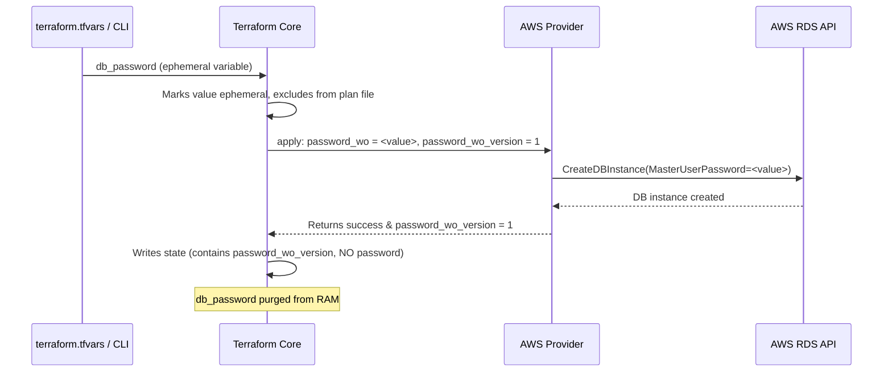

# AWS RDS Ephemeral Values & Write-Only Arguments (Terraform + AWS RDS)

This project provisions an `aws_db_instance` (Amazon RDS MySQL) using **write-only arguments** (`password_wo`) and **ephemeral variables**, ensuring sensitive credentials like database passwords never persist in the Terraform plan file or remote state file.

> **Note:** This repo is a learning and test project (`terraform-aws-rds-ephemeral`) for exploring ephemeral value handling introduced in modern Terraform releases.

---

## Project Layout


```

terraform-aws-rds-ephemeral/
├── readme.md                    # This documentation file
├── backend.tf                   # S3 remote state configuration
├── providers.tf                 # Terraform version constraints & AWS provider configuration
├── variables.tf                 # Input variable declarations (including ephemeral variables)
├── main.tf                      # RDS MySQL instance definition with password_wo
├── sample.tfvars                # Template for input variables (copy to terraform.tfvars)
└── .terraform.lock.hcl          # Dependency lock file for providers

```

---

## 1. The Problem These Features Solve

Normally, every value defined in a standard `resource` block — including passwords — is recorded in plain text in:

1. The **plan file** (`.tfplan`)
2. The **state file** (`terraform.tfstate`)

Marking a variable as `sensitive = true` only obscures output in stdout/terminal logs. It **does not encrypt or exclude** values from the `terraform.tfstate` file stored on disk or in your remote backend (e.g., your S3 bucket `terraform-logs-007`).

**Ephemeral values** and **write-only arguments** allow sensitive data to pass through Terraform during execution without being saved anywhere in state.

---

## 2. Ephemeral Values

An **ephemeral value** exists in system memory exclusively during the lifecycle of a `terraform plan` or `terraform apply` operation and is purged immediately after.

### Sources of Ephemeral Values

| Source | Example |
| :--- | :--- |
| **Ephemeral Variable** | `variable "db_password" { ephemeral = true }` |
| **Ephemeral Resource** | `ephemeral "random_password" "db" { length = 16 }` |
| **Ephemeral Output** | `ephemeral.random_password.db.result` |

### Key Rule
An ephemeral value **cannot flow into a standard resource argument**, standard output, or state file. It can only be passed to:
* Another ephemeral resource argument
* A **write-only argument** on a managed resource (`_wo`)
* An `ephemeral` output block

In `variables.tf`:
```hcl
variable "db_password" {
  type      = string
  sensitive = true
  ephemeral = true
}

```

Because `ephemeral = true` is set, Terraform guarantees the password value is discarded after `apply`.

---

## 3. Write-Only Arguments (`_wo`)

A **write-only argument** (indicated by a `_wo` suffix in provider schema) receives sensitive values, passes them to the cloud API during resource creation or modification, and immediately disbands them without storing them in state.

Because the password is never saved in state, standard diffing cannot detect drift. Therefore, write-only attributes require a companion **version integer argument** (`_wo_version`):

```hcl
resource "aws_db_instance" "default" {
  allocated_storage    = 10
  db_name              = "mydb"
  engine               = "mysql"
  engine_version       = "8.0"
  instance_class       = "db.t3.micro"
  username             = var.db_username
  
  # Write-only password handling
  password_wo          = var.db_password   # Value is passed to AWS and immediately discarded from state
  password_wo_version  = 1                 # Integer saved in state to track updates/rotations

  parameter_group_name = "default.mysql8.0"
  skip_final_snapshot  = false
}

```

### How Rotation Works

1. **Unchanged Version (`1`):** Terraform compares the stored state version integer against configuration. If `password_wo_version` remains `1`, Terraform skips updating the password (even if `var.db_password` changes).
2. **Incremented Version (`1` $\rightarrow$ `2`):** Bumping `password_wo_version = 2` triggers an in-place modification. Terraform passes the new `password_wo` value to the AWS RDS API and records `password_wo_version = 2` in state.

---

## 4. Standard vs. Write-Only Arguments

| Attribute Feature | Standard Argument (`username`) | Write-Only Argument (`password_wo`) |
| --- | --- | --- |
| **Accepts Ephemeral Inputs?** | ❌ No (Errors at plan time) | ✅ Yes |
| **Persisted in State File?** | ✅ Yes | ❌ Never |
| **Drift Detection Method** | Compares saved state string vs. config | Compares paired `_wo_version` integer |
| **Requires Version Companion?** | No | ✅ Yes (`password_wo_version`) |
| **Typical Use Cases** | `username`, `instance_class`, tags | Master passwords, API tokens, certificates |

---

## 5. End-to-End Operational Flow



---

## 6. Current Configuration Files

### `providers.tf`

```hcl
terraform {
  required_version = "~> 1.15.5"

  required_providers {
    aws = {
      source  = "hashicorp/aws"
      version = "6.64.0"
    }
  }
}

provider "aws" {
  region     = var.aws_region
  access_key = var.aws_access_key
  secret_key = var.aws_secret_key
}

```

### `backend.tf`

```hcl
terraform {
  backend "s3" {
    bucket       = "terraform-logs-007"
    key          = "production.tfstate/ap-south-1/terraform.tfstate"
    region       = "ap-south-1"
    use_lockfile = true
  }
}

```

### `variables.tf`

```hcl
variable "aws_access_key" {
  type = string
}

variable "aws_secret_key" {
  type = string
}

variable "aws_region" {
  type    = string
  default = "ap-south-1"
}

variable "db_username" {
  type      = string
  sensitive = true
}

variable "db_password" {
  type      = string
  sensitive = true
  ephemeral = true
}

```

### `main.tf`

```hcl
resource "aws_db_instance" "default" {
  allocated_storage    = 10
  db_name              = "mydb"
  engine               = "mysql"
  engine_version       = "8.0"
  instance_class       = "db.t3.micro"
  username             = var.db_username
  password_wo          = var.db_password
  password_wo_version  = 1
  parameter_group_name = "default.mysql8.0"
  skip_final_snapshot  = false
}

```

---

## 7. Recommended In-Memory Password Generation

Instead of passing secrets via `terraform.tfvars`, chain an ephemeral random password resource directly into the write-only argument:

```hcl
ephemeral "random_password" "db_password" {
  length           = 16
  special          = true
  override_special = "!#$%&*()-_=+[]{}<>:?"
}

resource "aws_db_instance" "default" {
  allocated_storage    = 10
  db_name              = "mydb"
  engine               = "mysql"
  engine_version       = "8.0"
  instance_class       = "db.t3.micro"
  username             = var.db_username
  
  # Generates and applies password directly in RAM
  password_wo          = ephemeral.random_password.db_password.result
  password_wo_version  = 1

  parameter_group_name = "default.mysql8.0"
  skip_final_snapshot  = false
}

```

---

## 8. What to Change Before Production

1. **Remove Long-Lived Static Credentials:** Avoid hardcoding `aws_access_key` and `aws_secret_key` in code or `.tfvars`. Rely on IAM Roles, AWS IAM Identity Center, or OIDC authentication for CI/CD pipelines.
2. **Automate Password Generation:** Use `ephemeral "random_password"` alongside AWS Secrets Manager to store credentials for application use without writing them to Terraform state.
3. **Strengthen State Security:** Enable S3 server-side encryption (SSE-KMS), bucket versioning, and strict IAM access policies for the state backend (`terraform-logs-007`).
4. **Harden RDS Configuration:** Enable production resiliency attributes on `aws_db_instance`:
* Set `multi_az = true`
* Set `deletion_protection = true`
* Set `skip_final_snapshot = false`
* Define an explicit `backup_retention_period` (e.g., `7` days)

